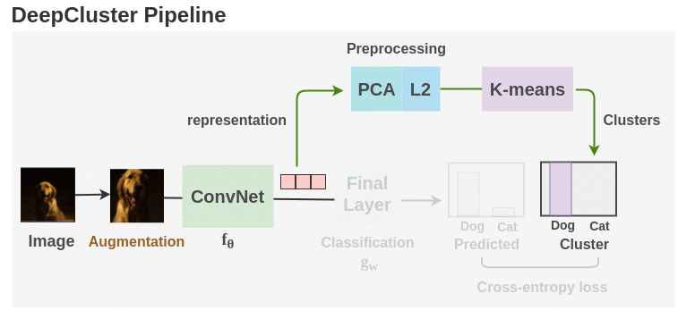

# Agri-Land-Detection
Suitable Agriculture Land Detection from Satellite Imaginary with Deep Clustering

## Overview
My project has two main parts, land detection with an unsupervised learning model and semantic segmentation for arable land using the supervised learning method. Firstly, I used the deep clustering method. Secondly, I extracted annotations from clustered images own, and train the U-Net model for semantic segmentation. 
In the end, we can show segmented arable land from satellite images.

### Data and Augmentation
The original dataset is from Sentinel-2 datasets, and I've downloaded it and done the pre-processing.

The data for training contains 202 256x256x3 images, which are far not enough to feed a deep-learning neural network. I use a module called ImageDataGenerator in keras.preprocessing.image to do data augmentation.
In the pre-processing part of the dataset, I used data augmentation to combat overfitting. 
Satellite images are loaded by applying random horizontal and vertical flips, and a random rotation. 
These transformations leverage the fact that these different special visualizations remain true to the location’s physical representation. 
Due to the nature of satellite imagery only cropping, rotations, reflections, and scaling were used for data augmentation because they
do not introduce distortion to objects like buildings.

### Model
  In the initial clustering phase of my project, I employed Deep Clustering, an unsupervised clustering method developed by the Facebook AI Research Team. The method consists of three key components: training the encoder, generating initial labels through means clustering, and performing deep clustering. For this part, I utilized the Keras API.

  In the second part of my project, I used a VGG image annotator and extracted some labels myself. Just I use good clustered arable land images. I extract some image annotations and get an annotation JSON file. After that, I use a Python script and save the mask as a png. See mask_extractor.py for detail.
  

file.

  

    Deep Clustering
  

  
  #
  - First, The encoder part of the model has pre-trained ResNet-50 architecture which was pre-trained by ImageNet.
  - The model has a flattened layer with uses the last convolutional output from the pre-trained model which has [8*8*2048] dimensional convolutional layer.
  - For the prior layers, we keep the BatchNorm layer that the ResNet-50 architecture uses after each convolution and prior to activation, which has an implicit regularization effect.
  - The output layer of the encoder is the "embedding" layer used for pseudo-label extraction.
  - The decoder part of my model was just used for training to encoder part of my model with high-dimensional images.
  - Secondly, I build a K-means clustering model to extract pseudo labels.
  - By training the autoencoder, we have its encoder part learned to compress each image into ten floating point values.
  - I am going to use K-Means to generate the cluster centroids, which are the 100 clusters’ centers in the 100-D feature space.
  - We are also going to build our custom clustering layer to convert input features to cluster label probability. The probability is calculated by t-distribution.
  -   

  

    Semantic Segmentation
  

  
  #
  - I have limited available segmentation masks for training. For this reason, I use transfer learning and augmentation 15 times for all images.
  - I train my model using pre-trained InceptionV3 and ResNet50 which are trained with the imagenet.
  - Integrated the resnet50 and Inception V3 pre-trained models to U-Net.
  

  This deep neural network is implemented with Keras functional API, which makes it extremely easy to experiment with different interesting architectures.
  
  Output from the network is 256*256 which represents a mask that should be learned. The sigmoid activation function makes sure that mask pixels are in \[0, 1\] range.

### Training

  

    Deep Clustering
  

  
  #
  - The deep clustering model has soft labeling, assigning an estimated class to each of the data samples in such a way that can be redefined iteratively.
  - The prepared deep clustering model is compiled with a stochastic gradient descent optimizer with 0.01 learning rate using with Kullback-Leibler loss function.
  - Model is training as iteratively that refines the clusters by learning from the high-confidence assignments with the help of the auxiliary target distribution.
  - The deep clustering model is trained by matching the soft assignment to the target distribution.
  - The target distribution is redefined one time in every 100 epochs.
  - The Kullback-Leibler loss calculates divergence loss between soft assignments and auxiliary distribution.

  

    Semantic Segmentation
  

  
  #
  
  - I train my model using pre-trained InceptionV3 and ResNet50 which are trained with the imagenet.
  - integrated the resnet50 and Inception V3 pre-trained models to U-Net.
  - The model is trained for 50 epochs.
  - After 5 epochs, the calculated accuracy is about 0.92.
  - Loss function for the training is basically just a binary cross-entropy.

---

## How to use

### Dependencies

This tutorial depends on the following libraries:

* Tensorflow 2.0
* PyTorch
* Keras >= 1.0

Also, this code should be compatible with Python versions Python 3.8–3.11.

### Run main.py

You will see the predicted results of test image in data/membrane/test

### Or follow notebook Deep-clustering_pytorch.ipynb, DeepClustering_ResNet50.ipynb, U-Net-semantic-segmentation.ipynb

### Results

Use the trained model to do segmentation on test images, the result is statisfactory.

## About Keras

Keras is a minimalist, highly modular neural networks library, written in Python and capable of running on top of either TensorFlow or Theano. It was developed with a focus on enabling fast experimentation. Being able to go from idea to result with the least possible delay is key to doing good research.

Use Keras if you need a deep-learning library that:

allows for easy and fast prototyping (through total modularity, minimalism, and extensibility).
supports both convolutional networks and recurrent networks, as well as combinations of the two.
supports arbitrary connectivity schemes (including multi-input and multi-output training).
runs seamlessly on CPU and GPU.
Read the documentation [Keras.io](http://keras.io/)
